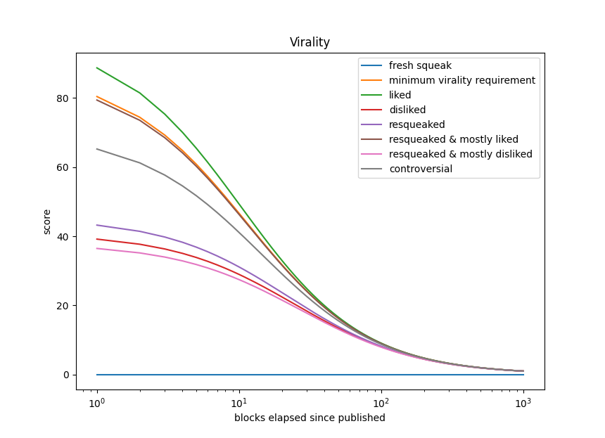
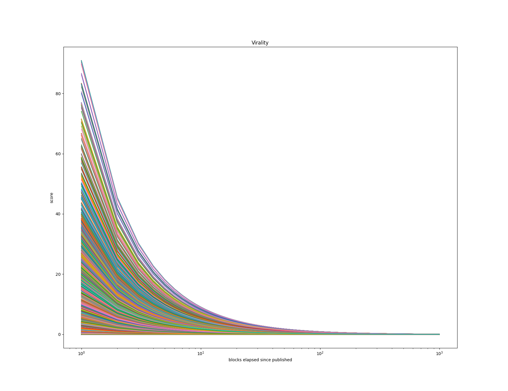

# 🧮 Algorithms

Implementation details of the algorithms used in [Critter](https://github.com/ahashim/critter).

### Virality

Given the properties of a squeak being the number of likes $\large L$, the
number of dislikes $\large D$, and the number of resqueaks $\large R$, we can
calculate the order of virality $\large \vartheta$ with the formula

$$
    \large
    \begin{array}{c}
      \vartheta \ = \ \sqrt{\frac{L}{D \ + \ 1}} \
      \times \
      \log{(L \ + \ D)} \
      \times \
      \frac{log{R}}{R}
    \end{array}
$$

where the coefficient of virality
$\large k\in\lbrace 0, \frac{1}{\vartheta} \rbrace$

$$
    \large
    \begin{array}{c}
      k \ = \ \begin{cases}
        0 &\text{if } \vartheta \ = \ 0 \\
        \frac{1}{\vartheta} &\text{otherwise}
      \end{cases}
    \end{array}
$$

and the number of blocks elapsed since publishing the squeak $\large x$, gives
us the full virality formula $V$ which only applies to squeaks with at least one
like $\large L$ and and one resqueaks $\large R$:

$$
    \large
    \begin{array}{c}
      V \ = \ \begin{cases}
        \frac{1000}{x \ + \ k \ + \ 10} &\text{if } L \ > \ 0 \ \And R \ > \ 0 \\
        \frac{0}{x} &\text{otherwise}
      \end{cases}
    \end{array}
$$

Plotting the formula with some mock data as input yields the following curve

Using a Pareto distribution of weighted random values for 10000 squeaks, we can
use the formula to verify that all squeaks fall within an acceptable range of
virality as blocks elapse.

If we assume a virality score of `95` for a squeak to be considered "viral",
this chart visually confirms that roughly 5% of squeaks that were generated
achieved that score in the distribution within the first few blocks.

